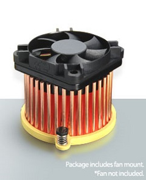
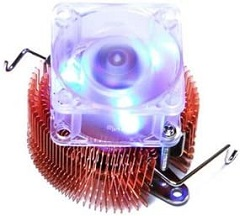
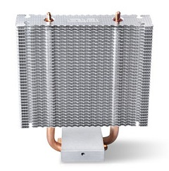
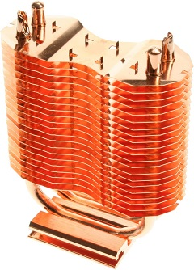

# Using HoneyComb LX2K as a Desktop


#### A guide for fully setting up the SolidRun LX2K with novice users in mind.


## Table of Contents:

1. [Specifications](#specs)
1. [Introduction](#intro)
1. [Important Notes](#notes)
1. [Thermal Management](#thermal)
1. [Prerequisites](#prereq)
1. [Console Connection](#console)
1. [Configuring LX2K](#config)
1. [Installing an Operating System](#os)
1. [Post-Install Recommendations](#reccomend)
1. [BoxWine (x86 & x86_64) Setup Guide](#x86)
1. [BIOS Navigation](#bios)
1. [Overclocking & Timings](#timings)
1. [Troubleshooting](#issues)
1. [Credits](#thanks)

<a name="specs"/>

## Specifications

- Board form factor
  - Mini-ITX
- CPU
  - NXP Layerscape LX2160A 16-core ARM Cortex-A72; 2Ghz (stable overclock to 2.2Ghz all-core)
- RAM
  - 2x DDR4 SODIMM slots @ up to 3200Mhz
    - if you have one module then use top slot or use 202105 firmware (or newer)
  - XMP profiles are supported
  - ECC supported
  - Up to 64GB
  - Supports only 1.2v modules
- Storage
  - m.2 slot for PCI Express Gen3 x4 NVME
  - 4x Serial ATA III ports
  - Onboard eMMC 64GB
  - MicroSD Slot
  - SPI Flash for firmware
- Network
  - 1x Gigabit Ethernet with RJ-45 connector
  - 4x 10GbE ports (40Gb support) with SFP+ connectors
- PCI Express
  - x8 half-slot (open-ended, x16 card support), PCI Express Gen3
- USB
  - 2x USB 3 ports
  - 1x USB 3 header (2 ports)
  - 1x USB 2 header (2 ports)
- Interface
  - 1x micro USB port for serial console
  - 1x micro USB port for management
  - 1x JTAG header
- Cooling
  - 40mm Heatsink (standard on older GPU's)


<a name="intro"/>

## Introduction

The SolidRun HoneyComb LX2K (ClearFog) is a Mini-ITX form-factor ARM64 development board. Can be used for enterprise networking, security, automotive, server applications, and as a developer workstation. The team at Solidrun as well as many freelance developers have really poured their hearts into working out all the small bugs that come with a niche product, and the SoM being mainly targeted for embedded use. That being said, I personally recommend the LX2K as a 64-bit ARM desktop for those that are seriously considering a capable RISC-based system to use as their daily driver.

Using an x8 or x16 PCIe 3.0 workstation GPU, many applications such as Blender, RBDOOM-3, Portal 2 and console emulators run laps around the Raspberry Pi 4, RockPro64, and Odroid XU-4. Many games run at 3440x1440 @ 60fps as long as you aren't going ham on the render options, Minecraft running at 60fps @ 18-22 chunks, and OpenMW running @ 60fps with everything turned to max. And with Box86 and Wine, there are many native and foreign x86 applications that run smoothly such as Fallout 3, Skyrim, and even Crysis 1 and 2.

_The guide below is a WIP, and I greatly appreciate any comments regarding how I can improve this page, and will try to answer any questions thrown my way._

<a name="notes"/>

## Important Notes

- Onboard Gigabit Ethernet may not work out-of-the-box, must apply kernel patches or use USB (or PCIe) Ethernet adaptor.
  - Using Linux kernel 5.14 (or newer) all on-board ports work.
  - You can build an older kernel with SolidRun patches from the [SolidRun GitHub page](https://github.com/SolidRun/linux-stable).
- nVidia GPU's only support framebuffer on Linux 5.17(?) and below. Future nVidia OSS Kernel driver supposedly remedies. Currently have not tested.
- SolidRun firmware images can be downloaded as [UEFI](https://images.solid-run.com/LX2k/lx2160a_uefi) or [U-Boot](https://images.solid-run.com/LX2k/lx2160a_build) (like on Rasperry/Pi or other popular SBC).
  - UEFI image is highly recommended
- The EDKII UEFI BIOS will sometimes hang at splash under certain reboot conditions.
  - simply wait a few seconds and boot again
- If you experience frequent crashing, no wake from sleep, etc., make sure GRUB Linux Defaults are set as well as disabling sleep/hibernate services.
- At time of writing there appears to be minor window boarder and text artifacting on occasion; shouldn't affect overall experience.
- Booting with some keyboards (usually gaming ones) may not register during POST and will not respond to input. Once booted into Linux drivers will pick up any non-standard keyboards. I.e.: You may need a 2nd generic USB keyboard to highlight BIOS options.
- Use Wayland over X11 if at all possible, X has much more bugs with GPU acceleration and Wayland has the ability to launch X windows anyway.

<a name="thermal"/>

## Thermal Management

When you receive your LX2K SoM, you may notice the rather modest heatsink. Under light operation this is no issue, however, if you use multithreaded compiling, play games or want to run performance benchmarks, you may want to upgrade the stock cooler. Below are some aftermarket products used by some LX2K users, and should help get better thermals out of your machine.

name | shop | image
--|--|--
Enzotech | [coolerguys.com](https://www.coolerguys.com/products/enzotech-northbridge-heatsink-cnb-r1) | 
Silenx | [amazon.com](https://www.amazon.com/dp/B002OHPKSY) | 
PC Northbridge Cooler | [moddiy.com](https://www.moddiy.com/products/PC-Cooler-H.D.T-Technology-Northbridge-Cooler-) | 
Connectland | [amazon.com](https://www.amazon.com/-/en/gp/product/B004HO5D98) | 
Acrylic Mounts | [khayie.com](https://www.khayie.com/products/acrylic-cpu-water-cooling-waterblock-heatsink-buckles-screw-m2-5x35mm-for-northbridge-for-graphics-card?variant=32399047458916) | 


 <a name="prereq"/>

## Prerequisites

You will need the following items:
 - 512MB+ MicroSD card
 - 2GB+ USB Thumb Drive
 - USB Ethernet Adapter (try sticking with generic, Realtek based chips if possible)
 - Build computer/SBC with an SD slot or adaptor
 - (recommended) Micro USB cable
 - (recommended) Radeon GCN 5th Gen or lower
 - (recommended) Standard USB Keyboard (i.e.: A cheap usb keyboard)

<a name="console"/>

## Console Connection

 - Serial (COM#)
 - Speed: 115200
 - Data Bits: 8
 - Stop Bits: 1
 - Parity: NONE
 - Flow Control: XON/XOFF

NOTE: Make sure to connect Micro USB cable to the Console port (the one closer to 1GbE connector).

<a name="config"/>

## Configuring LX2K

1. Assuming your board has USB Ethernet adaptor, RAM, Storage, PSU and GPU (optional) installed, head here on your build computer [https://images.solid-run.com/LX2k] to download the Tianocore EDKII UEFI firmware.

2. On the images page, click the link "lx2160a_uefi" and select the appropriate image file.

*NOTE (2a): There are three parts of the filename to focus on: "2000" = CPU Speed, "xx00" = RAM Speed, "sd/flexspi" = Target Install. All have the same CPU speed, so make sure you grab the file with correct RAM speed and "sd" for MicroSD card.*

*NOTE (2b): flexspi_nor can be used to install to internal SPI Flash. [Haven't tested]*

*NOTE (2c): This image can be built from scratch and is explained at the bottom of this guide.*

3. Flash the img.xz file to your uSD card using dd or BalenaEtcher.

4. Insert the uSD into the back of the LX2K.

*NOTE (4): At this point you may begin using the board, you may now also connect over console via Micro USB. Using the Micro USB cable is useful for controlling BIOS over serial, troubleshooting boot issues, and installing some OS' that only work in console mode.*

<a name="os"/>

## Installing an Operating System

1. [Debian](Install-Debian.md)
2. [Ubuntu](Install-Ubuntu.md)
3. [Fedora](Install-Fedora.md)
4. [openSUSE](Install-SUSE.md)
5. [Arch](Install-ArchLinux.md)
6. [Void](Install-Void-glibc.md)
7. [Windows 10](Install-Windows.md)
8. [Windows 10/QEMU](Install-Windows-Qemu.md)

<a name="reccomend"/>

## Post-Install Recommendations

### Mesa Patch

Mesa should be working out-of-the-box in newer or rolling release distributions. However, if you experfience UI graphical issues related to window boarders, text elements, and garbled artifacting in programs, please try out the patch below:

Debian/Ubuntu Dependencies:
```
sudo apt install git build-essential bison flex bc meson pkg-config cmake libvdpau-dev glslang-tools libomxil-bellagio-dev libva-dev libvulkan-dev python3-pip libdrm-dev llvm-dev libelf-dev wayland-protocols libwayland-egl-backend-dev libxext-dev libxdamage-dev libxcb-glx0-dev libxcb-shm0-dev libx11-xcb-dev libxcb-dri2-0-dev libxcb-dri3-dev libxcb-present-dev libxshmfence-dev libxxf86vm-dev libxrandr-dev ninja-build
```
Void Linux Dependencies:
```
sudo xbps-install wget git bison flex bc meson cmake pkg-config wayland-protocols python3-pip ninja patch gcc python3-Mako libdrm-devel llvm12 wayland-devel libX11-devel libXext-devel libXfixes-devel libxshmfence-devel libXxf86vm-devel libXrandr-devel elfutils-devel
```
Arch Linux Dependencies:
```
sudo pacman -Sy base-devel cmake python-mako llvm wayland-protocols libdrm libx11 libxext libxfixes libxshmfence libxxf86vm libxrandr elfutils libvdpau compiler-rt libmicrohttpd glslang libclc
```
Fedora Dependencies: (Not required; Fedora comes pre-patched!)
```
sudo dnf install flex bison make cmake automake gcc gcc-c++ kernel-devel meson ninja-build libdrm-devel libvdpau-devel llvm-devel libX11-devel libxcb-devel libva-devel wayland-devel wayland-protocols-devel libXext-devel libXfixes-devel libxshmfence-devel libXxf86vm-devel libXrandr-devel python3-mako libomxil-bellagio-devel libXdamage-devel lld-devel expat-devel libunwind-devel glslang libclc-devel libglvnd-core-devel clang-devel
```
openSUSE Dependencies:
```
sudo zypper source-install --build-deps-only Mesa
sudo zypper install -t pattern devel_basis
sudo zypper install clang-devel libunwind-devel libexpat-devel libclc libglvnd-devel lld glslang-devel vulkan-devel libvdpau-devel
```
```
sudo mkdir -p ~/build && cd ~/build
sudo apt remove mesa-*
git clone https://gitlab.freedesktop.org/mesa/mesa.git && cd mesa
git pull && git checkout --track origin/21.0	[Only run this command on Debian 11!]
wget https://github.com/Wooty-B/LX2K_Guide/raw/main/0001-radeonsi-On-Aarch64-force-persistent-buffers-to-GTT.patch
patch -p1 < 0001-radeonsi-On-Aarch64-force-persistent-buffers-to-GTT.patch
mkdir build && cd build
meson .. --libdir /usr/lib/aarch64-linux-gnu/ --prefix /usr/ -Dgallium-drivers=radeonsi,swrast,zink -Dvulkan-drivers=amd -Dgallium-nine=true -Dbuildtype=release
sudo ninja install
```

### Buffer Overflow Fix

This patch can fix crashes in some applications.

```
git clone https://github.com/jnettlet/cortex_a72_memcpy.git
cd cortex_a72_memcpy; make
cp libmemcpy.so /lib/aarch64-linux-gnu/libmemcpy.so
nano /etc/ld.so.preload
	/lib/aarch64-linux-gnu/libmemcpy.so
sudo reboot
```

### Possible Crash on Sleep/Suspend

If the system crashes constantly on sleep/suspend event, use this command to disable:

```
sudo systemctl mask sleep.target suspend.target hibernate.target hybrid-sleep.target
```

## BoxWine (x86 & x86_64) Setup Guide

Project BoxWine is my guide for easily installing and configuring your system for running x86 Linux and Windows applications natively. It includes the Box86 and Box64 projects by ptitseb then layers Wine on top of that. The guide also includes instructions for Steam, Android container, chroot setup as well as an installer script used to do all of this for you automatically. Even better, the installer script includes a function to also automatically install and setup HoneyComb LX2K patches for users with AMD GPU's!

[Project BoxWine - Native x86 Setup Guide](https://github.com/Wooty-B/Project_BoxWine)

<a name="bios"/>

## BIOS Navigation

	NOTE: Upon powering up, press ESC at the splash to enter the BIOS menu.

	A. Select Language
		1. Standard English
		2. Standard French
		3. English
		4. French
	B. Device Manager
		1. Device List
			a. Tls Auth Configuration
				- Configures Client/Server TLS Certificates
			b. RAM Disk Configuration
				- Create a RAM storage device from system memory.
			c. O/S Hardware Description Selection
				- Select between ACPI mode or Device Tree (ACPI, better for UEFI; DT, better for U-Boot)
			d. Console Preference Selection
				- Boot the system in "Graphical" (video) or "Console" (serial) mode
			e. iSCSI Configuration
				- Configure iSCSI
			f. Network Device List
				- Select NIC and configure boot/protocol settings
	C. Boot Manager
		1. Boot Manager Menu
			- Lists all bootable devices including custom entries
	D. Boot Maintenance Manager
		1. Boot Options
			a. Add Boot Option
				- Select a bootable EFI file from device list to add to boot list
			b. Delete Boot Option
				- Remove an entry from the boot list
			c. Change Boot Order
				- Use + and - to change an entry's load order in the boot list
		2. Driver Options
			- Add, Remove, and Delete custom EFI boot drivers including load order
		3. Console Options
			- Change Console input/output devices, number of lines (width/height), baud rate, etc.
		4. Boot From File
			a. Boot From File
				- Select an EFI file from device list to immediatly boot from
		5. Boot Next Value
			- Select an entry from the boot list to load on next reboot
		6. Auto Boot Time-out
			- Enter a value for how long the Splash Screen is shown for (Default value is 10)
	E. Continue
		- Continue booting the system as normal
	F. Reset
		- Immediately reboot the system

<a name="timings"/>

## Overclocking & Timings

Remember that playing with overclocking requires properly working cooling
solution. LX2160A cpu used in HoneyComb will shutdown at around 95°C.

Contrary to x86-64 you do not get any options in firmware setup to do
overclocking. Instead you have to build UEFI firmware with other clock values.

### Fetch sources

Clone git repository with firmware source:
```
git clone https://github.com/SolidRun/lx2160a_uefi.git
```

### Check for required dependencies

Enter the newly created "lx2160a_uefi" folder and run:
```
INITIALIZE=1 ./runme.sh
```

### Build parameters

There are few parameters that can be used to control firmware build:

parameter | default value | description
--|--|--
SOC_SPEED | 2000 | Sets the CPU Clock Speed (in MHz)
BUS_SPEED | 700 | Sets Bus frequency (in MHz)
DDR_SPEED | 2400 | Sets the DDR4 RAM timings (needs to be rounded to 100s)
XMP_PROFILE | 0 | Enables XMP Profile (ex. XMP_PROFILE=1 enables XMP, XMP_PROFILE=0 disables XMP)
X86EMU | 0 | Enables x86 emulator for Option ROMs (enable only if plan to use NVidia graphics)
AMDGOP | 1 | Add graphics driver for AMD Radeon cards
SERDES | 8_5_2 | SERDES configuration (do not touch if you do not know what it is)
BOOT_MODE | sd | are you building firmware for loading from MicroSD (sd) or for on-board SPI (flexspi_nor)
INITIALIZE | 1|  Used to check are dependencies installed

### Build firmware

Select from the parameters above and build your firmware image:
```
SOC_SPEED=2200 DDR_SPEED=3200 BUS_SPEED=700 XMP_PROFILE=1 BOOT_MODE=sd ./runme.sh
```

Will build an image with CPU speed of 2.2GHz, bus @ 700MHz, DDR4 memory speed @ 3.2GHz with XMP disabled.

Resulting file will be stored in "images/" directory and named "lx2160acex7_2200_700_3200_8_5_2_sd_xxxxxxx.img".

Write firmware image to MicroSD card (use dd or other similar tool). Insert into into LX2K and reboot.

<a name="issues"/>

### Benchmarking

Here are a few benchmarking resources with ARM compatability in mind.

Geekbench 5: https://cdn.geekbench.com/Geekbench-5.4.0-LinuxARMPreview.tar.gz

PassMark PerformanceTest: https://www.passmark.com/downloads/pt_linux_arm64.zip

Phoronix Test Suite: https://www.phoronix-test-suite.com/?k=downloads

## Troubleshooting

The HoneyComb LX2K is a powerful development platform for ARM, however there can be some quirks or misconceptions. If you run into a wall or an anomoly, please check the HoneyComb Issus documentation below for more information.

[HoneyComb Issues](HoneyComb-Issues.md)

<a name="thanks"/>

## Credits

Diving into the setup of this board was daunting given my previous experience, however this guide would not be possible without the assistance from the following:

@hrw - Helping with this guide and giving me tips along the way

@jnettlet - For being patient and helping me thoroughly understand the LX2K, all while providing major development for this board

@ptitSeb - All his hard work with Box86 and additionally adding LX2160A specific support

@HanoJing - For documenting troubleshooting tips.

rna (Armbian Forums) - For writing the ARM 32-bit chroot guide I used as well as 64-bit wine info
